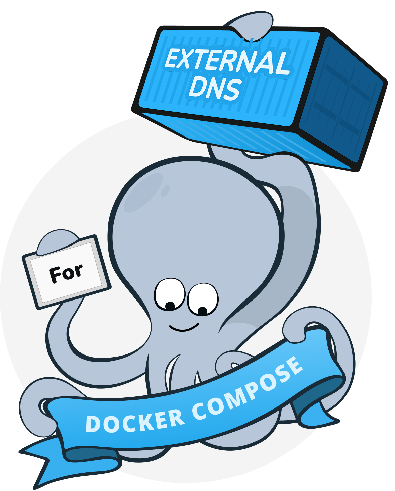

<p align="center">
 
</p>


# Docker-External-DNS

`docker-external-dns` is a lightweight, Go-based tool designed to automatically synchronize DNS records from various sources (like Docker containers and Traefik routers) to external DNS providers. This currently supports Cloudflare and Pi-hole.

This project is inspired by [kubernetes-sigs/external-dns](https://github.com/kubernetes-sigs/external-dns). It acts similarly to Kubernetes' `external-dns`, but is specifically tailored for lightweight Docker Compose or standalone Docker environments.

Latest images can be found at [Docker Hub (techtricks/docker-external-dns)](https://hub.docker.com/r/techtricks/docker-external-dns).

## Features

- **Multiple Sources:**
  - **Docker:** Reads JSON labels from running Docker containers to extract desired DNS records.
  - **Traefik:** Connects to the Traefik HTTP API, parses routing rules (e.g., `Host('example.com')`), and automatically registers them as `A` records.
- **Multiple Providers:**
  - **Cloudflare:** Synchronizes `A`, `CNAME`, `MX`, and `NS` records using the Cloudflare API. Supports proxying.
  - **Pi-hole:** Synchronizes `A` and `CNAME` records to a local Pi-hole instance using the Pi-hole custom DNS API.
- **Modular and Lightweight:** Written entirely in Go. Compiles to a single binary with a minimal memory footprint.

## Configuration

The application is configured entirely via environment variables:

| Variable | Default | Description |
|---|---|---|
| `DNS_PROVIDER` | `cloudflare` | The DNS provider to use. Options: `cloudflare`, `pihole` |
| `DNS_SOURCE` | `docker` | The source of truth for DNS records. Options: `docker`, `traefik` |
| `INTERVAL_SECONDS` | `60` | Polling interval in seconds to check for changes |
| `IDENTIFIER` | `docker-external-dns` | The identifier used to track which records are managed by this app. Used as the Cloudflare record comment and the Docker label key |
| `LOG_LEVEL` | `info` | The application logging level. Options: `debug`, `info`, `warn`, `error` |
| `DOMAIN_FILTER` | *empty* | Comma-separated list of domains to filter by (e.g., `example.com,test.example.com`). Only records matching these domains will be synced. |

### Cloudflare Provider Variables
| Variable | Default | Description |
|---|---|---|
| `CF_API_TOKEN` | *empty* | **Required** if using Cloudflare. Your Cloudflare API token with DNS Edit permissions |

### Pi-hole Provider Variables
| Variable | Default | Description |
|---|---|---|
| `PIHOLE_URL` | *empty* | **Required** if using Pi-hole. The base URL (e.g., `http://192.168.1.10`) |
| `PIHOLE_API_VERSION`| `6` | Set to `5` to use the legacy Pi-hole v5 API |
| `PIHOLE_PASSWORD` | *empty* | Required if using Pi-hole v6. Your web interface password or an App Password. *Note: If using an App Password, you must set `FTLCONF_webserver_api_app_sudo=true` in your Pi-hole environment to allow modifications. Default is false which is read-only.* |
| `PIHOLE_API_TOKEN` | *empty* | Required if using Pi-hole v5. The API token (found in Pi-hole Settings -> API) |
| `PIHOLE_SKIP_VERIFY`| `false` | Optional boolean (`true` or `false`) to skip TLS verification if connecting to Pi-hole via an internal HTTPS IP with a self-signed certificate. |

### Docker Source Variables
| Variable | Default | Description |
|---|---|---|
| `DOCKER_HOST` | `unix:///var/run/docker.sock` | The docker daemon socket path. **You can specify multiple hosts by separating them with a comma (e.g., `unix:///var/run/docker.sock,tcp://[IP_ADDRESS]:[PORT]`).** Use port `2376` for TLS and `2375` for unencrypted. |
| `DOCKER_TLS_VERIFY` | *empty* | Set to `1` to enforce strict Mutual TLS (mTLS) verification when connecting to a remote Docker TCP daemon. |
| `DOCKER_CERT_PATH` | *empty* | The directory path (e.g., `/certs`) inside the container where `ca.pem`, `cert.pem`, and `key.pem` are located for TLS authentication. |

> [!NOTE]
> You **do not** need to provide `DOCKER_HOST` if you are mapping the socket to the standard path inside the container (e.g., via `volumes: ["/var/run/docker.sock:/var/run/docker.sock"]`). However, if you *do* define `DOCKER_HOST` (for example, to add a remote TCP host), you must explicitly include `unix:///var/run/docker.sock` in your `DOCKER_HOST` list **AND** keep the volume mount so the container can access the local socket file!
> It is only necessary for custom environments:
> - Rootless Docker setups (e.g., `DOCKER_HOST=unix:///run/user/1000/docker.sock`)
> - Network-based remote TCP daemons (e.g., `DOCKER_HOST=tcp://[IP_ADDRESS]:[PORT]`)

### Traefik Source Variables
| Variable | Default | Description |
|---|---|---|
| `TRAEFIK_API_URL` | `http://localhost:8080` | **Required** if using Traefik. URL to Traefik's API |
| `TRAEFIK_TARGET_IP`| `127.0.0.1` | **Required** if using Traefik. The IP address that Traefik routes should point to (usually the public IP of your Traefik server) |
| `TRAEFIK_USERNAME` | *empty* | Optional username if your Traefik API is protected by Basic Auth |
| `TRAEFIK_PASSWORD` | *empty* | Optional password if your Traefik API is protected by Basic Auth |
| `TRAEFIK_SKIP_VERIFY`| `false` | Optional boolean (`true` or `false`) to skip TLS verification if Traefik is using a self-signed cert or you are connecting via IP. |
| `TRAEFIK_INSTANCES`| *empty* | **Required** if using multiple Traefik endpoints. Input URLs, Target IPs, Usernames, Passwords and TLS preferences as JSON array. |

> [!NOTE]
> **Multiple Traefik Endpoints:** You can configure multiple Traefik endpoints by setting the `TRAEFIK_INSTANCES` environment variable to a JSON array. If `TRAEFIK_INSTANCES` is defined, the individual variables above (`TRAEFIK_API_URL`, etc.) are completely ignored.
> ```yaml
> environment:
>   - |
>     TRAEFIK_INSTANCES=[
>       {
>         "url": "http://traefik:8080",
>         "target": "192.168.2.190",
>         "username": "admin",
>         "password": "password",
>         "skip_verify": true
>       },
>       {
>         "url": "https://test-traefik.example.com",
>         "target": "192.168.2.170"
>       }
>     ]
> ```

## Usage Examples

### 1. Docker Source with Cloudflare

Run the syncer as a container, mapping the Docker socket:

```yaml
services:
  external-dns:
    build: .
    environment:
      - DNS_PROVIDER=cloudflare
      - DNS_SOURCE=docker
      - CF_API_TOKEN=your_token_here
    volumes:
      - /var/run/docker.sock:/var/run/docker.sock:ro

  my-app:
    image: nginx
    labels:
      - 'docker-external-dns=[{"type": "A", "name": "app.example.com", "address": "1.2.3.4", "proxy": true}]'
```

**Docker Label Syntax:**
The label key must match your `IDENTIFIER` environment variable (default: `docker-external-dns`). The value must be a valid JSON array of record objects:
- `type`: `A`, `CNAME`, `MX`, or `NS`
- `name`: The FQDN (e.g. `test.example.com`)
- `address`: The target IP (used for `A` records)
- `target`: The target FQDN (used for `CNAME` records)
- `server`: The target server (used for `MX` and `NS` records)
- `proxy`: boolean (Cloudflare only)
- `priority`: integer (MX records only)

### 2. Traefik Source with Pi-hole

```yaml
services:
  external-dns:
    build: .
    environment:
      - DNS_PROVIDER=pihole
      - DNS_SOURCE=traefik
      - PIHOLE_URL=http://192.168.1.53
      - PIHOLE_API_TOKEN=your_pihole_token
      - TRAEFIK_API_URL=http://traefik:8080
      - TRAEFIK_TARGET_IP=192.168.1.100
```

With this setup, any Traefik router (e.g., `Host('dashboard.local')`) will automatically get an `A` record added to your Pi-hole pointing to `192.168.1.100`.

### 3. Adding DNS Records to Your Apps (Docker Labels)

If you are using the `docker` source, you can tell `docker-external-dns` to create records for your applications by adding a JSON array to the `docker-external-dns` label of your container. 

Here is an example of adding an `A` record and a proxied `CNAME` record to a service named `my-app`:

```yaml
services:
  my-app:
    image: nginx:latest
    labels:
      - |
        docker-external-dns=[
          {
            "type": "A",
            "name": "myapp.example.com",
            "address": "192.168.1.100"
          },
          {
            "type": "CNAME",
            "name": "www.myapp.example.com",
            "target": "myapp.example.com",
            "proxy": true
          },
          {
            "type": "MX",
            "name": "myapp.example.com",
            "server": "mail.myapp.example.com",
            "priority": 10
          },
          {
            "type": "NS",
            "name": "myapp.example.com",
            "server": "ns1.myapp.example.com"
          }
        ]
```

### 4. Advanced: Multi-Host Synchronization

`docker-external-dns` is built to handle complex, multi-node environments with ease. You can aggregate and synchronize DNS records across multiple remote servers simultaneously.

For detailed tutorials on setting up Multi-Host Synchronization, please refer to the advanced documentation:

*   **[Syncing DNS records from multiple Docker hosts](https://add-link-here.com):** By defining a comma-separated list of Docker socket URIs or TCP endpoints in the `DOCKER_HOST` variable, you can securely aggregate Docker labels from multiple standalone engines.
*   **[Syncing DNS records from multiple Docker hosts via Traefik](https://add-link-here.com):** If you run Traefik across multiple Docker nodes, you can centralize your DNS synchronization by scraping the routing tables from each proxy. By providing a JSON array to the `TRAEFIK_INSTANCES` variable, you can connect to multiple independent Traefik APIs (even those on completely separate networks) and seamlessly merge their routes together.

### 5. Custom/Corporate SSL Certificates

If you are using a custom or corporate Certificate Authority (CA) and want to keep TLS verification enabled (`TRAEFIK_SKIP_VERIFY=false` or `PIHOLE_SKIP_VERIFY=false`), you must provide your CA certificate to the container. Because the application is written in Go, it natively supports standard SSL environment variables and Linux trust stores.

**Option A: Share the Host Machine's Trust Store**
If your Docker host already trusts your corporate CA, you can simply mount the host's certificate file into the container:
```yaml
    volumes:
      - /etc/ssl/certs/ca-certificates.crt:/etc/ssl/certs/ca-certificates.crt:ro
```
*(Note: Use `/etc/pki/tls/certs/ca-bundle.crt` if your host is RHEL/CentOS)*

**Option B: Mount the Specific Certificate**
If you have the `.pem` or `.crt` file, you can mount it directly and instruct Go to use it via the `SSL_CERT_FILE` environment variable:
```yaml
    environment:
      - SSL_CERT_FILE=/certs/corporate-ca.pem
    volumes:
      - ./corporate-ca.pem:/certs/corporate-ca.pem:ro
```

## Building the Project

Since this project uses Go, you can build it locally if you have Go 1.22+ installed:
```bash
go build -o docker-external-dns ./cmd/docker-external-dns
```

Alternatively, just use Docker:
```bash
docker build -t docker-external-dns .
docker run -d --name external-dns docker-external-dns
```
